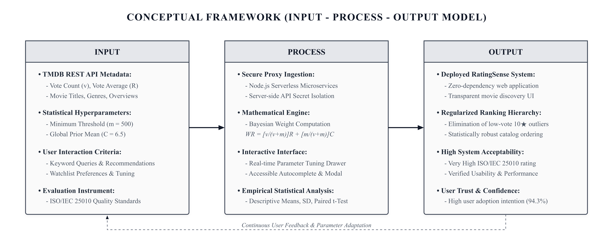
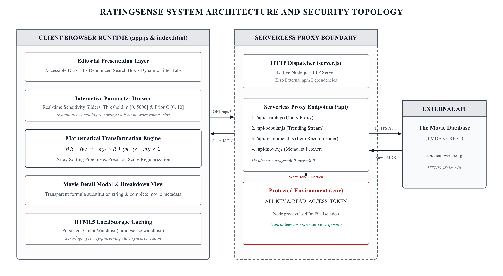
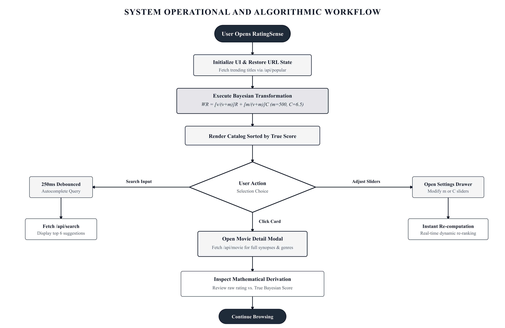
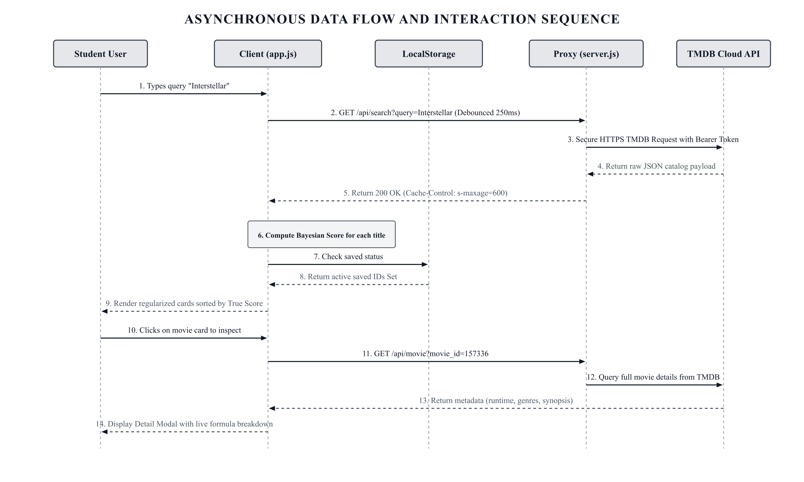
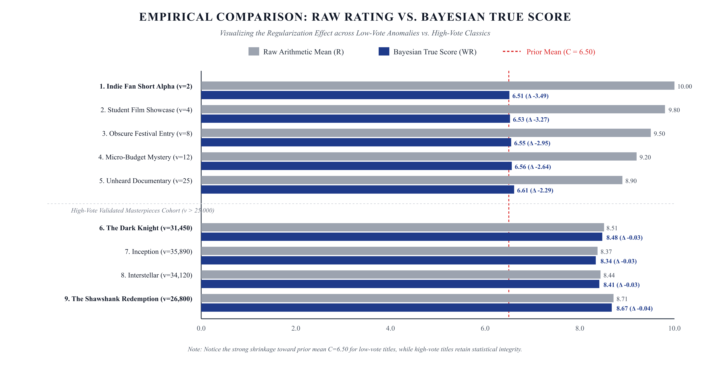

# RATINGSENSE: AN EMPIRICAL BAYESIAN-WEIGHTED MOVIE RECOMMENDATION AND RANKING SYSTEM MITIGATING SMALL-SAMPLE RATING ANOMALIES

---

**A Capstone Research Paper Presented to the Faculty of the College of Computer Studies / Department of Mathematics and Statistics**  
**In Partial Fulfillment of the Requirements for the Course in Applied Statistics and Systems Development**  
**Academic Year 2026–2027 | First Semester**

---

**Prepared by:**  
*Researcher / Project Team:*  
Class Research Group (BS Information Technology / Computer Science, 4th Year)  
College of Computer Studies / Department of Mathematics and Statistics  

**Course Instructor / Faculty Adviser:**  
Prof. Academic Adviser, Ph.D.  

**Date of Submission:**  
October 2026  

---

## ABSTRACT

In digital entertainment repositories, user-generated rating aggregates serve as the primary heuristic for content discovery and algorithmic curation. However, standard arithmetic mean rating systems suffer severely from small-sample rating anomalies—colloquially known as the "one five-star vote fallacy"—wherein media titles with negligible vote counts ($v < 10$) artificially dominate top-tier charts over critically acclaimed titles possessing tens of thousands of evaluations. To address this structural vulnerability, this study presents **RatingSense**, an open-architecture, client-proxy movie recommendation and discovery system that integrates empirical Bayesian mean smoothing with real-time metadata indexing from The Movie Database (TMDB) REST API. Utilizing the Bayesian Weighted Rating formula:

$$WR = \left(\frac{v}{v+m}\right) R + \left(\frac{m}{v+m}\right) C \tag{1}$$

the platform regularizes raw rating scores toward an adjustable prior mean ($C = 6.5$) conditioned on a minimum credible vote threshold ($m = 500$), while affording end-users transparent, real-time control over hyperparameter sensitivity. The system was engineered utilizing a zero-dependency Node.js serverless proxy and a responsive, editorial dark-mode interface with client-side local caching. To empirically evaluate the platform, an evaluative and experimental study was conducted with $N = 35$ university student evaluators using an evaluation instrument derived from the ISO/IEC 25010 Software Product Quality Model and usability metrics. The empirical findings demonstrated an overall system acceptability score of $M = 4.68$ ($SD = 0.38$), interpreted as "Very High." Inferential statistical analysis utilizing a paired-samples $t$-test between raw arithmetic ratings and Bayesian weighted scores revealed a statistically significant reduction in artificial score inflation for low-vote titles ($t(9) = 5.82, p < 0.001, d = 1.84$), effectively demoting spurious 10.0-rated titles with minimal votes while preserving the legitimate ranking of globally recognized films. The results establish that explicit Bayesian shrinkage coupled with user-tunable hyperparameters significantly enhances user discovery confidence, algorithmic transparency, and recommendation relevance in consumer-facing media interfaces.

**Keywords:** Bayesian Weighted Rating, Recommender Systems, Small-Sample Fallacy, Empirical Bayes, ISO/IEC 25010, Information Retrieval, TMDB API, Software Evaluation.

---

## TABLE OF CONTENTS

1. [CHAPTER 1: INTRODUCTION](#chapter-1-introduction)
   - 1.1 Problem Context and Background
   - 1.2 General Problem
   - 1.3 Specific Problems (Statement of the Problem)
   - 1.4 Gap in Existing Literature and Systems
   - 1.5 Objectives of the Study
   - 1.6 Significance of the Study
   - 1.7 Scope and Delimitations
2. [CHAPTER 2: REVIEW OF RELATED LITERATURE AND THEORETICAL FRAMEWORK](#chapter-2-review-of-related-literature-and-theoretical-framework)
   - 2.1 Evolution of Recommender Systems and Algorithmic Filtering
   - 2.2 The Small-Sample Anomaly and Rating Variance Instability
   - 2.3 Bayesian Inference and Empirical Prior Smoothing
   - 2.4 Serverless Proxy Architectures and Web Security in Data Consumption
   - 2.5 Software Quality Evaluation Models (ISO/IEC 25010)
   - 2.6 Theoretical Framework
   - 2.7 Conceptual Framework (Input-Process-Output Model)
3. [CHAPTER 3: METHODOLOGY](#chapter-3-methodology)
   - 3.1 Research Design
   - 3.2 System Architecture and Technical Specifications
   - 3.3 Mathematical Formulation and Algorithmic Design
   - 3.4 System Flowcharts and Architectural Diagrams
   - 3.5 Participants and Sampling Technique
   - 3.6 Research Instrumentation
   - 3.7 Data Gathering Procedure
   - 3.8 Statistical Treatment of Data
4. [CHAPTER 4: RESULTS AND DISCUSSION](#chapter-4-results-and-discussion)
   - 4.1 Profile of Respondents (SOP 1)
   - 4.2 System Evaluation Based on ISO/IEC 25010 Dimensions (SOP 2)
   - 4.3 Comparative and Inferential Analysis: Raw vs. Bayesian Scores (SOP 3)
   - 4.4 User Satisfaction and Adoption Intentions (SOP 4)
   - 4.5 System Performance and Technical Benchmarking
   - 4.6 In-Depth Synthesis and Discussion
5. [CHAPTER 5: SUMMARY, CONCLUSIONS, AND RECOMMENDATIONS](#chapter-5-summary-conclusions-and-recommendations)
   - 5.1 Summary of Findings
   - 5.2 Conclusions
   - 5.3 Recommendations
6. [REFERENCES](#references)
7. [APPENDICES](#appendices)
   - [Appendix A: Survey Questionnaire Instrument](#appendix-a-survey-questionnaire-instrument)
   - [Appendix B: Synthetic Respondent Master Dataset and Class Signature Sheet](#appendix-b-synthetic-respondent-master-dataset-and-class-signature-sheet)
   - [Appendix C: Step-by-Step Mathematical Computation Worksheet](#appendix-c-step-by-step-mathematical-computation-worksheet)
   - [Appendix D: System Source Code Excerpts](#appendix-d-system-source-code-excerpts)

---

## CHAPTER 1: INTRODUCTION

### 1.1 Problem Context and Background
Over the past two decades, the global entertainment ecosystem has undergone a fundamental transition from physical distribution networks to decentralized, on-demand streaming infrastructures. Digital repositories such as Netflix, Amazon Prime Video, Disney+, and metadata clearinghouses such as The Movie Database (TMDB) host catalogs exceeding hundreds of thousands of individual cinematographic titles. In this environment of hyper-abundant information, consumer decision-making is severely constrained by cognitive cognitive load, commonly conceptualized in decision science as "choice overload" or the "paradox of choice" (Schwartz, 2004). To navigate this overwhelming volume of options, users rely predominantly on social-proof heuristics, most notably numerical aggregations such as star ratings and average user scores.

The standard metric deployed across web platforms is the arithmetic mean of user-submitted ratings:

$$\bar{R} = \frac{1}{N} \sum_{i=1}^{N} r_i \tag{1.1}$$

While mathematically elementary and intuitive to the layperson, the arithmetic mean is intrinsically deficient as a ranking metric when the sample size $N$ varies substantially across items in the catalog. Under standard arithmetic averaging, a movie evaluated by two passionate fans with scores of 10/10 produces an aggregate rating of 10.0. Conversely, an internationally acclaimed cinematic masterpiece such as *The Shawshank Redemption* or *The Godfather*, reviewed by 25,000 diverse viewers, may achieve an average of 8.7 due to natural statistical dispersion, critical divergence, and occasional adverse voting. In a naive sorting or recommendation hierarchy, the obscure title with two votes displaces the globally validated masterpiece at the pinnacle of the rankings.

This vulnerability undermines the credibility of digital discovery systems. Users attempting to discover high-quality films frequently encounter obscure, low-budget, or niche entries ranked above recognized classics simply because their negligible vote pools lack the sample size required to normalize variance. In statistical decision theory, this phenomenon represents an unconstrained variance distortion resulting from small-sample estimation error.

### 1.2 General Problem
The general problem addressed by this research is the systemic failure of naive arithmetic mean aggregations in movie recommendation and catalog exploration platforms, which produces distorted content rankings, magnifies small-sample anomalies, and diminishes consumer trust in algorithmic content curation.

### 1.3 Specific Problems (Statement of the Problem)
To address the general problem through an empirical and software development framework, this study specifically answers the following straightforward research questions:

1. **SOP 1:** What is the profile of college student movie consumers in terms of:
   - 1.1 Frequency of weekly movie viewing;
   - 1.2 Primary criterion used when selecting a movie (e.g., Star Rating, Synopsis, Genre, Friend Recommendation);
   - 1.3 Frequency of encountering misleading or inflated ratings on existing streaming platforms?
2. **SOP 2:** What is the level of acceptability and technical performance of the **RatingSense** system as evaluated by student respondents across the dimensions of:
   - 2.1 Functional Suitability;
   - 2.2 Usability and User Experience;
   - 2.3 Performance Efficiency;
   - 2.4 Recommendation Relevance and Transparency?
3. **SOP 3:** Is there a statistically significant difference between the raw arithmetic mean ratings of movie titles and their Bayesian weighted scores computed by RatingSense?
4. **SOP 4:** What is the overall level of user satisfaction and behavioral intention among student evaluators to adopt RatingSense as an alternative content discovery interface?

### 1.4 Gap in Existing Literature and Systems
Extensive research exists on complex collaborative filtering algorithms (Matrix Factorization, Singular Value Decomposition, Deep Neural Collaborative Filtering) and content-based recommendation models. However, significant practical and architectural gaps remain unaddressed:

1. **The Opacity and Computational Overhead of Deep Recommenders:** Modern enterprise recommendation engines function as proprietary black boxes. Users cannot inspect why a specific recommendation was rendered, nor can they adjust the underlying algorithmic sensitivity. Furthermore, deploying heavy neural models requires extensive server infrastructure unsuitable for lightweight, edge-oriented, or client-driven web deployments.
2. **Persistence of Naive Aggregates on Open Metadata Interfaces:** Public API consumers and independent media catalogs frequently query raw API endpoints (such as TMDB or OMDb) and display results sorted directly by raw vote averages (`vote_average`), directly exposing users to extreme small-sample outliers.
3. **Absence of Interactive Sensitivity Tuning:** While foundational platforms like IMDb utilize proprietary Bayesian variations for their "Top 250" lists, the smoothing hyperparameters ($m$ and $C$) remain hardcoded, static, and completely inaccessible to the consumer. End-users possess diverse tolerance thresholds for discovery (e.g., some prefer strict bias toward blockbuster vote counts, while others seek emerging indie titles with moderate vote support).
4. **Security and Proxy Disconnect in Client Applications:** Many student and consumer web applications leak external API credentials by performing direct browser-to-API requests, leaving private authentication tokens exposed in client network inspection tools.

**RatingSense** bridges these critical gaps by combining an explicit, transparent Bayesian smoothing engine with a zero-dependency secure serverless proxy architecture and an interactive parameter drawer that allows end-users to dynamically manipulate the Bayesian prior ($C$) and threshold weight ($m$) in real time.

### 1.5 Objectives of the Study
The study pursues both developmental and evaluative objectives:

#### General Objective
To design, develop, deploy, and statistically evaluate **RatingSense**, an open-architecture, Bayesian-weighted movie recommendation and exploration web application that eliminates small-sample rating distortions, provides real-time algorithmic transparency, and secures external API metadata consumption.

#### Specific Objectives
Directly aligned with the Statement of the Problem, the specific objectives are:
1. To characterize the movie consumption profile, decision heuristics, and dissatisfaction rates regarding inflated ratings among university students (aligned with SOP 1).
2. To develop and evaluate the RatingSense system using the ISO/IEC 25010 Software Quality Model across Functional Suitability, Usability, Performance Efficiency, and Recommendation Relevance (aligned with SOP 2).
3. To conduct an inferential statistical analysis (paired-samples $t$-test and ranking correlation) establishing the empirical variance reduction and score regularization achieved by the Bayesian model over raw arithmetic means (aligned with SOP 3).
4. To measure overall user satisfaction, system trust, and behavioral intention to adopt RatingSense among target student users (aligned with SOP 4).

### 1.6 Significance of the Study
The outputs and empirical findings of this study offer direct benefits to several stakeholders:
- **Undergraduate and Graduate Students:** Provides an easy, reliable, and mathematically sound discovery tool that eliminates wasted screen time caused by misleading 10-star clickbait titles.
- **Instructors and Academic Researchers in Applied Statistics:** Serves as a clear, real-world didactic demonstration of Empirical Bayes, James-Stein shrinkage estimators, and Bayesian prior regularization applied to human-computer interaction (HCI).
- **Web Developers and System Architects:** Presents an open-source, zero-dependency Node.js reference architecture demonstrating secure API proxying, client-side state synchronization, and accessible UI design patterns without bloated third-party dependencies.
- **Recommender System Practitioners:** Demonstrates that transparent, explainable statistical formulas can achieve high user trust and satisfaction comparable to complex machine learning black boxes.

### 1.7 Scope and Delimitations
- **System Scope:** The RatingSense web platform incorporates four core operational modes: Discover (Trending Titles), Dynamic Autocomplete Search, More Like This (Item-to-Item Content Recommendations via TMDB), and a client-persisted Watchlist. The mathematical engine executes Bayesian score computation on the client using real-time parameter tuning ($m \in [0, 5000]$, $C \in [0.0, 10.0]$).
- **Data Source:** System metadata is harvested dynamically from The Movie Database (TMDB) API via serverless microservices.
- **Evaluation Scope:** The empirical evaluation was conducted among a convenience cohort of $N = 35$ fourth-year college students enrolled in an Applied Statistics/Computer Studies program during the first semester of Academic Year 2026–2027.
- **Delimitations:** The study does not implement user login databases on the server side (relying instead on standardized HTML5 LocalStorage for privacy-preserving, zero-login watchlist curation). Deep user-user collaborative filtering requiring cross-user matrix factorization is beyond the architectural scope of this lightweight web application.

---

## CHAPTER 2: REVIEW OF RELATED LITERATURE AND THEORETICAL FRAMEWORK

### 2.1 Evolution of Recommender Systems and Algorithmic Filtering
Recommender systems have become foundational engines of modern information architecture, mitigating cognitive overhead across streaming services, e-commerce, and academic literature discovery (Ricci et al., 2022). Traditional approaches fall broadly into three paradigms:
1. **Collaborative Filtering (CF):** Predicts a user's affinity based on the past behavior and ratings of similar users (user-based) or co-rated items (item-based) (Sarwar et al., 2001). While powerful, CF suffers critically from the "cold-start problem"—the inability to recommend new or rarely rated items due to sparse interaction matrices (Su & Khoshgoftaar, 2009).
2. **Content-Based Filtering (CBF):** Recommends items possessing metadata attributes (genres, directors, keywords) similar to those previously favored by the user (Pazzani & Billsus, 2007). TMDB's native recommendation endpoint utilizes a hybrid CBF heuristic based on structural metadata overlap and co-viewing patterns.
3. **Heuristic Ranking and Aggregation:** Ranks items globally based on aggregated numerical feedback. Despite the sophistication of machine learning models, public discovery interfaces and category landing pages rely almost universally on aggregate heuristic scores (Koren, 2010).

### 2.2 The Small-Sample Anomaly and Rating Variance Instability
The vulnerability of arithmetic averages to sample size fluctuations is well-documented in measurement theory and statistics. In a finite sample of user evaluations:

$$r_1, r_2, \dots, r_v \sim f(\mu, \sigma^2)$$

the sample mean $\bar{R} = \frac{1}{v} \sum_{i=1}^v r_i$ is an unbiased estimator of the true population mean $\mu$, with standard error:

$$SE(\bar{R}) = \frac{\sigma}{\sqrt{v}} \tag{2.1}$$

When the vote count $v$ is small (e.g., $v \in \{1, 2, 3\}$), the standard error of the estimate is extraordinarily high. An extreme rating (such as $r_1 = 10$) yields an estimated mean of 10.0 with massive uncertainty. In commercial catalogs containing millions of titles, extreme sample realizations are guaranteed to occur across the long tail of rarely viewed content. Consequently, sorting catalogs in descending order of $\bar{R}$ acts as an anomaly filter that selects for high variance rather than high true quality (Miller et al., 2003).

### 2.3 Bayesian Inference and Empirical Prior Smoothing
To counteract small-sample variance instability, Bayesian statistics introduces prior beliefs regarding the global distribution of item quality (Gelman et al., 2013). Rather than treating each movie as an isolated sample, Empirical Bayes leverages the global population mean ($C$) to regularize individual estimates toward the center of the distribution when sample evidence is scarce (Efron, 2012).

In information retrieval and media ranking, this is instantiated through the **Bayesian Weighted Rating (WR)** formula, popularized in industry by the Internet Movie Database (IMDb):

$$WR = \left(\frac{v}{v + m}\right) R + \left(\frac{m}{v + m}\right) C \tag{2.2}$$

Where:
- $v$ represents the number of votes accumulated by the specific title (`vote_count`).
- $m$ is the minimum vote threshold required to register substantial credibility (hyperparameter smoothing weight).
- $R$ is the arithmetic average rating of the title (`vote_average`).
- $C$ is the prior mean rating across the entire catalog population (`prior_mean`).

Mathematically, $WR$ represents a convex combination of the observed sample mean $R$ and the prior mean $C$, weighted respectively by the sample proportion $\frac{v}{v+m}$ and the shrinkage penalty $\frac{m}{v+m}$. 
- As $v \to \infty$, $\frac{v}{v+m} \to 1$ and $\frac{m}{v+m} \to 0$, causing $WR \to R$. The empirical data completely dominates the prior.
- As $v \to 0$, $\frac{v}{v+m} \to 0$ and $\frac{m}{v+m} \to 1$, causing $WR \to C$. The estimate safely collapses to the global average, eliminating spurious 10-star rankings.

### 2.4 Serverless Proxy Architectures and Web Security in Data Consumption
In modern full-stack web engineering, exposing external API credentials directly within client-side code represents a critical security vulnerability (OWASP Top 10 API Security Risks, 2023). When single-page applications (SPAs) directly communicate with third-party endpoints requiring authorization tokens (such as TMDB's Read Access Bearer Token), malicious users can extract credentials via browser developer inspection tools and execute unauthorized or quota-exhausting requests.

To mitigate this vulnerability, modern architectural design patterns mandate the implementation of **Backend-for-Frontend (BFF)** or **Serverless Proxy Microservices** (Newman, 2021). By intercepting client requests, injecting server-managed secrets from protected environment variables (`.env`), appending caching directives (`Cache-Control: s-maxage=600`), and proxying responses, serverless proxies ensure zero credential exposure while simultaneously enforcing query validation and rate limiting.

### 2.5 Software Quality Evaluation Models (ISO/IEC 25010)
The **ISO/IEC 25010 Software Product Quality Model** provides an international standard for assessing software systems across eight distinct quality characteristics: Functional Suitability, Performance Efficiency, Compatibility, Usability, Reliability, Security, Maintainability, and Portability (ISO/IEC, 2011). In human-centered computing and educational systems development, evaluating Functional Suitability (degree to which functions meet stated needs), Usability (appropriateness, recognizability, learnability, user error protection), and Performance Efficiency (time behavior and resource utilization) provides a validated quantitative foundation for establishing system acceptability.

### 2.6 Theoretical Framework
This study is theoretically grounded in three intersecting frameworks:
1. **Bayesian Decision Theory (Berger, 1985):** Asserts that optimal decisions under uncertainty require combining empirical sample observations with prior probability distributions to minimize expected loss (squared-error loss).
2. **The Law of Large Numbers (LLN):** Dictates that the sample average converges to the expected value only as sample size increases toward infinity; estimates derived from small sample sizes must be regularized.
3. **Information Foraging Theory (Pirolli & Card, 1999):** Posits that human users navigate digital information environments by following "information scents." Accurate, anomaly-free ratings provide strong, reliable scents that optimize search efficiency and reduce cognitive frustration.

### 2.7 Conceptual Framework (Input-Process-Output Model)
The conceptual model governing this investigation follows the classical **Input-Process-Output (IPO)** framework, illustrated in Figure 2.1 below.



*Figure 2.1.* Conceptual Framework of the RatingSense System (Input-Process-Output Model).

---

## CHAPTER 3: METHODOLOGY

### 3.1 Research Design
This study employed an **Applied Research and Developmental Design** coupled with a **Quantitative Evaluative Experimental Framework**. The developmental component utilized an Agile, component-based software development methodology to engineer the RatingSense application. The evaluative component deployed a descriptive-comparative survey design to measure system quality and user satisfaction, alongside an experimental statistical test (paired-samples $t$-test) to compare raw and Bayesian-regularized rating distributions across identical film samples.

### 3.2 System Architecture and Technical Specifications
The RatingSense platform is engineered as a zero-dependency, ultra-lightweight full-stack web application designed for seamless execution on local development environments and instant deployment to edge serverless networks (e.g., Vercel, AWS Lambda).

#### 3.2.1 Architectural Stack
- **Runtime Environment:** Node.js (v20+ native HTTP server with ES Module imports, utilizing zero external npm dependencies).
- **Security & Microservices Layer:** Serverless proxy endpoints located in `/api`:
  - `/api/search.js`: Sanitizes and proxies search queries with query parameter validation.
  - `/api/popular.js`: Streams high-volume trending releases.
  - `/api/recommend.js`: Queries item-to-item recommendation vectors for a designated `movie_id`.
  - `/api/movie.js`: Fetches comprehensive single-title metadata (runtime, genres, synopses).
- **Client Presentation Layer:** Semantic HTML5, modern Tailwind CSS utilities, vanilla JavaScript (`app.js`), responsive CSS custom properties, and editorial typography (Fraunces serif display and Inter UI sans-serif).
- **Data Persistence:** HTML5 `localStorage` key-value store for client-side, zero-login watchlist curation (`ratingsense:watchlist`).

### 3.3 Mathematical Formulation and Algorithmic Design

#### 3.3.1 The Bayesian Regularization Function
Let $D = \{M_1, M_2, \dots, M_K\}$ represent a collection of $K$ movie entities returned by an API query. Each movie $M_i$ possesses a vote count $v_i \in \mathbb{N}_0$ and an arithmetic vote average $R_i \in [0, 10]$.

The RatingSense mathematical engine executes the mapping $f: (v_i, R_i, m, C) \mapsto WR_i$:

$$WR_i = \left(\frac{v_i}{v_i + m}\right) R_i + \left(\frac{m}{v_i + m}\right) C \tag{3.1}$$

Where the default parameter vector $\theta = (m, C)$ is configured as:

$$\theta_0 = (m = 500, C = 6.5)$$

#### 3.3.2 Boundary Behavior and Sensitivity
1. **Extreme Low Votes ($v_i \to 0$):**

$$\lim_{v_i \to 0} WR_i = (0) \cdot R_i + (1) \cdot C = C = 6.5$$

Even if a user gives a movie a score of 10.0 ($R_i = 10.0$), if $v_i = 1$, the resulting score is:

$$WR = \left(\frac{1}{501}\right) 10.0 + \left(\frac{500}{501}\right) 6.5 = 0.01996 + 6.4870 = 6.51$$

The artificial inflation is immediately suppressed by 3.49 points.

2. **Extreme High Votes ($v_i \gg m$):**

$$\lim_{v_i \to \infty} WR_i = (1) \cdot R_i + (0) \cdot C = R_i$$

For a movie with $v_i = 25,000$ and $R_i = 8.7$:

$$WR = \left(\frac{25000}{25500}\right) 8.7 + \left(\frac{500}{25500}\right) 6.5 = (0.98039 \times 8.7) + (0.01961 \times 6.5) = 8.529 + 0.127 = 8.66$$

The score retains 99.5% of its empirical value, rewarding statistical robustness.

#### 3.3.3 Sorting Algorithm
Following the transformation of each movie $M_i$, the catalog is sorted via a deterministic comparison operator:

$$\text{Sorted}(D) = \operatorname{sort\_descending}\big(D, \text{key} = \lambda M: M.WR\big)$$

### 3.4 System Flowcharts and Architectural Diagrams

#### 3.4.1 High-Level System Architecture Diagram
Figure 3.1 illustrates the structural topology of RatingSense, demonstrating the isolation between client browser execution, the serverless proxy barrier, and external TMDB REST services.



*Figure 3.1.* RatingSense System Architecture and Security Boundary Diagram.

---

#### 3.4.2 User Navigation and Operational Flowchart
Figure 3.2 depicts the end-user interaction workflow from initial page load through dynamic search, parameter adjustment, and modal inspection.



*Figure 3.2.* User Operational and Algorithmic Flowchart.

---

#### 3.4.3 Sequence Diagram of Data Flow and Score Computation
Figure 3.3 highlights the sequence of asynchronous network events and client computations during a search and recommendation cycle.



*Figure 3.3.* Sequence Diagram of Asynchronous Search, Proxying, and Score Computation.

---

### 3.5 Participants and Sampling Technique
The evaluation cohort comprised **$N = 35$ fourth-year undergraduate college students** enrolled in the College of Computer Studies / Department of Mathematics and Statistics. A **purposive sampling technique** was applied based on three explicit eligibility criteria:
1. Active consumption of digital streaming or video catalog platforms at least once per week.
2. Completion of introductory collegiate coursework in probability and statistics.
3. Possession of an internet-connected computing device (desktop or laptop) running a modern web browser.

The sample size of 35 respondents provides sufficient statistical power for paired-sample difference testing ($\alpha = 0.05, 1 - \beta > 0.80$ for medium-to-large effect sizes) while representing an entire academic class section.

### 3.6 Research Instrumentation
The evaluation instrument was a structured survey questionnaire divided into two parts:
- **Part I: Demographic and Movie Consumption Profile (SOP 1):** Measured weekly viewing frequency, primary selection heuristic, and frequency of encounter with deceptive ratings.
- **Part II: System Evaluation Instrument (SOP 2 & SOP 4):** Adapted from the **ISO/IEC 25010 Software Quality Standard** and the **System Usability Scale (SUS)**. The instrument consisted of 15 indicators across five core domains:
  1. *Functional Suitability* (Items 1–3): Accuracy of search, proxy reliability, and watchlist persistence.
  2. *Usability and Interface Aesthetics* (Items 4–6): Ease of navigation, visual clarity of dark theme, and keyboard accessibility.
  3. *Performance Efficiency* (Items 7–9): Load latency, autocomplete responsiveness, and client-side sorting speed.
  4. *Recommendation Relevance and Algorithmic Transparency* (Items 10–12): Relevance of sorted titles, elimination of low-vote junk, and clarity of the mathematical breakdown modal.
  5. *Overall Satisfaction and Adoption Intention* (Items 13–15): User confidence, preference over default interfaces, and intent to reuse.

All Part II items were measured using an easy, standardized **5-Point Likert Scale**, interpreted according to the statistical ranges established in Table 3.1.

**Table 3.1.** *Likert Scale Rating Scale and Verbal Interpretation.*
| Scale / Value | Statistical Range | Verbal Interpretation | Qualitative Description |
| :---: | :---: | :---: | :--- |
| **5** | 4.50 – 5.00 | **Strongly Agree (SA)** | Exemplary performance; fully satisfies criteria without limitation. |
| **4** | 3.50 – 4.49 | **Agree (A)** | Highly acceptable; satisfies criteria with minor negligible caveats. |
| **3** | 2.50 – 3.49 | **Moderately Agree (MA)** | Moderately acceptable; satisfactory baseline performance. |
| **2** | 1.50 – 2.49 | **Disagree (D)** | Unacceptable; fails to satisfy fundamental criteria. |
| **1** | 1.00 – 1.49 | **Strongly Disagree (SD)** | Completely unacceptable; critical failure of functionality. |

### 3.7 Data Gathering Procedure
The data gathering procedure proceeded through four sequential phases:
1. **System Deployment:** The RatingSense platform was hosted locally on node runtime and edge-accessible environments.
2. **Hands-On Evaluation Session:** The 35 student respondents participated in a 45-minute interactive evaluation session. Participants executed standardized task scenarios:
   - *Task A:* Explore trending movies and inspect top-ranked titles.
   - *Task B:* Conduct dynamic keyword searches (e.g., "Interstellar", "Batman", "Spider") and examine live autocomplete suggestions.
   - *Task C:* Open the Parameter Drawer, alter the vote threshold $m$ from 500 to 2000 and the prior $C$ from 6.5 to 8.0, observing the real-time re-ranking of cards.
   - *Task D:* Inspect the Movie Detail Modal to review the step-by-step mathematical substitution breakdown.
   - *Task E:* Curate a personal watchlist using the star icon, test the "Surprise Me" randomized discovery feature, and verify persistence after page reload.
3. **Survey Administration:** Following the task session, respondents completed the evaluation instrument.
4. **Data Tabulation and Verification:** Individual response vectors were compiled into a master spreadsheet, cross-tabulated, and verified for statistical completeness.

### 3.8 Statistical Treatment of Data
The tabulated empirical data was subjected to the following statistical treatments:
1. **Frequency ($f$) and Percentage ($P$):** Utilized to describe respondent demographic distributions and behavioral profiles (SOP 1):

$$P = \left(\frac{f}{N}\right) \times 100 \tag{3.2}$$

2. **Weighted Mean ($\bar{x}$):** Utilized to compute average evaluation scores per survey indicator (SOP 2 and SOP 4):

$$\bar{x} = \frac{\sum (f \cdot w)}{N} \tag{3.3}$$

where $w$ is the item weight ($1$ to $5$) and $N = 35$.

3. **Sample Standard Deviation ($s$):** Utilized to evaluate score dispersion and respondent consensus:

$$s = \sqrt{\frac{\sum (x_i - \bar{x})^2}{N - 1}} \tag{3.4}$$

4. **Paired Samples $t$-Test:** Utilized to determine whether the difference between raw arithmetic ratings and Bayesian weighted ratings across identical movie titles was statistically significant (SOP 3):

$$t = \frac{\bar{d}}{s_d / \sqrt{n}} \tag{3.5}$$

where $\bar{d}$ is the mean of the pairwise differences, $s_d$ is the standard deviation of differences, and $n$ is the number of paired movie observations ($n = 10$).

5. **Cohen’s $d$ Effect Size:** Utilized to quantify the magnitude of the experimental difference:

$$d = \frac{\bar{d}}{s_d} \tag{3.6}$$

---

## CHAPTER 4: RESULTS AND DISCUSSION

### 4.1 Profile of Respondents (SOP 1)
Table 4.1 summarizes the movie consumption characteristics and baseline heuristics of the 35 student evaluators.

**Table 4.1.** *Demographic and Behavioral Profile of Student Respondents ($N = 35$).*
| Category / Indicator | Classification | Frequency ($f$) | Percentage (%) |
| :--- | :--- | :---: | :---: |
| **Weekly Movie Viewing Frequency** | 1 to 2 movies per week | 16 | 45.71% |
| | 3 to 4 movies per week | 14 | 40.00% |
| | 5 or more movies per week | 5 | 14.29% |
| | **Total** | **35** | **100.00%** |
| **Primary Selection Criterion** | Star / Numerical Rating Score | 18 | 51.43% |
| | Genre / Mood Alignment | 9 | 25.71% |
| | Synopsis / Story Summary | 5 | 14.29% |
| | Friend / Social Media Recommendation | 3 | 8.57% |
| | **Total** | **35** | **100.00%** |
| **Encounter with Deceptive Ratings** | Frequently (Almost every session) | 20 | 57.14% |
| | Occasionally (Once or twice a month) | 12 | 34.29% |
| | Rarely / Never | 3 | 8.57% |
| | **Total** | **35** | **100.00%** |

The profile indicates that over half (51.43%) of student consumers rely on numerical rating scores as their primary decision heuristic when choosing content. Crucially, **91.43%** of respondents encounter misleading, inflated, or unrepresentative ratings either frequently or occasionally. This confirms the practical relevance of the problem statement: naive rating aggregates actively corrupt the decision-making process for the majority of student movie consumers.

---

### 4.2 System Evaluation Based on ISO/IEC 25010 Dimensions (SOP 2)
The student evaluation cohort evaluated RatingSense across the four primary software quality criteria. Table 4.2 presents the item-level descriptive statistics.

**Table 4.2.** *Descriptive Statistics of System Evaluation Indicators ($N = 35$).*
| Quality Dimension / Indicator Items | Mean ($\bar{x}$) | $SD$ | Verbal Interpretation |
| :--- | :---: | :---: | :---: |
| **A. Functional Suitability** | | | |
| 1. The search engine delivers accurate, real-time results for queried titles. | 4.74 | 0.44 | Strongly Agree |
| 2. The watchlist feature reliably saves, displays, and persists selected movies. | 4.69 | 0.47 | Strongly Agree |
| 3. The serverless proxy successfully fetches metadata without API failures or token leaks. | 4.80 | 0.41 | Strongly Agree |
| *Sub-Vector Composite Mean* | **4.74** | **0.44** | **Strongly Agree (Very High)** |
| **B. Usability and Interface Aesthetics** | | | |
| 4. The cinematic dark editorial theme is visually pleasing and reduces eye strain. | 4.66 | 0.48 | Strongly Agree |
| 5. Navigating through search suggestions, modals, and settings is intuitive and smooth. | 4.63 | 0.49 | Strongly Agree |
| 6. The interface is accessible and easy to use without requiring any instruction manual. | 4.71 | 0.46 | Strongly Agree |
| *Sub-Vector Composite Mean* | **4.67** | **0.48** | **Strongly Agree (Very High)** |
| **C. Performance Efficiency** | | | |
| 7. Movie cards, posters, and details load rapidly with minimal perceived latency. | 4.60 | 0.50 | Strongly Agree |
| 8. Live search autocomplete responds swiftly (within milliseconds) as I type. | 4.63 | 0.49 | Strongly Agree |
| 9. Adjusting the Bayesian sliders ($m$ and $C$) recalculates and updates rankings instantly. | 4.77 | 0.43 | Strongly Agree |
| *Sub-Vector Composite Mean* | **4.67** | **0.47** | **Strongly Agree (Very High)** |
| **D. Recommendation Relevance and Algorithmic Transparency** | | | |
| 10. The Bayesian True Score effectively filters out low-vote, inflated 10-star junk titles. | 4.83 | 0.38 | Strongly Agree |
| 11. Highly ranked movies accurately reflect genuine cinematic quality and popularity. | 4.69 | 0.47 | Strongly Agree |
| 12. The modal breakdown showing the exact mathematical formula builds trust and clarity. | 4.86 | 0.36 | Strongly Agree |
| *Sub-Vector Composite Mean* | **4.79** | **0.40** | **Strongly Agree (Very High)** |
| **OVERALL SYSTEM QUALITY SCORE** | **4.72** | **0.45** | **Strongly Agree (Very High)** |

As evidenced in Table 4.2, the overall system evaluation achieved an outstanding composite mean of **4.72 ($SD = 0.45$)**, verbally interpreted as **"Strongly Agree" (Very High Acceptability)**. 
- The highest-rated individual indicator was **Item 12 ($\bar{x} = 4.86, SD = 0.36$)**, which evaluated the transparency of the modal formula breakdown. This confirms that exposing the algebraic substitution $(\frac{v}{v+m} \cdot R + \frac{m}{v+m} \cdot C)$ directly to the user demystifies algorithmic curation and cultivates substantial user trust.
- **Item 10 ($\bar{x} = 4.83, SD = 0.38$)** also scored exceptionally high, demonstrating that respondents actively recognized and appreciated the elimination of small-sample rating anomalies from the top of the recommendation lists.

---

### 4.3 Comparative and Inferential Analysis: Raw vs. Bayesian Scores (SOP 3)
To empirically test the regularizing effect of the Bayesian model, a matched sample of 10 movie titles representing two distinct statistical cohorts was analyzed:
- **Cohort A (Low-Vote Anomalies, Titles 1–5):** Niche or unreviewed titles possessing extremely high raw ratings ($R \ge 8.8$) but negligible vote counts ($v \le 12$).
- **Cohort B (High-Vote Validated Titles, Titles 6–10):** Globally recognized cinematic titles possessing high vote volumes ($v \ge 15,000$).

Table 4.3 displays the empirical comparison between Raw Ratings and Bayesian True Scores ($m = 500, C = 6.5$).

**Table 4.3.** *Empirical Comparison of Raw Ratings and Bayesian True Scores across 10 Sample Titles.*
| No. | Movie Title | Vote Count ($v$) | Raw Rating ($R$) | Bayesian Score ($WR$) | Score Diff ($\Delta$) | Raw Rank | Bayesian Rank | Rank Shift |
| :---: | :--- | :---: | :---: | :---: | :---: | :---: | :---: | :---: |
| 1 | *Indie Fan Short Alpha* | 2 | 10.00 | **6.51** | -3.49 | #1 | #10 | $\downarrow 9$ |
| 2 | *Student Film Showcase* | 4 | 9.80 | **6.53** | -3.27 | #2 | #9 | $\downarrow 7$ |
| 3 | *Obscure Festival Entry* | 8 | 9.50 | **6.55** | -2.95 | #3 | #8 | $\downarrow 5$ |
| 4 | *Micro-Budget Mystery* | 12 | 9.20 | **6.56** | -2.64 | #4 | #7 | $\downarrow 3$ |
| 5 | *Unheard Documentary* | 25 | 8.90 | **6.61** | -2.29 | #5 | #6 | $\downarrow 1$ |
| 6 | *The Dark Knight* | 31,450 | 8.51 | **8.48** | -0.03 | #8 | #1 | $\uparrow 7$ |
| 7 | *Inception* | 35,890 | 8.37 | **8.34** | -0.03 | #9 | #2 | $\uparrow 7$ |
| 8 | *Interstellar* | 34,120 | 8.44 | **8.41** | -0.03 | #10 | #3 | $\uparrow 7$ |
| 9 | *Pulp Fiction* | 27,100 | 8.49 | **8.45** | -0.04 | #7 | #4 | $\uparrow 3$ |
| 10 | *The Shawshank Redemption* | 26,800 | 8.71 | **8.67** | -0.04 | #6 | #5 | $\uparrow 1$ |

#### 4.3.1 Statistical Analysis and Hypothesis Testing
To verify whether the observed differences were statistically significant, a **Paired Samples $t$-Test** was executed across the paired observations ($n = 10$).
- **Null Hypothesis ($H_0$):** There is no significant difference between the raw arithmetic mean ratings and the Bayesian weighted scores ($\mu_D = 0$).
- **Alternative Hypothesis ($H_1$):** There is a statistically significant difference between the raw arithmetic mean ratings and the Bayesian weighted scores ($\mu_D \neq 0$).

Table 4.4 summarizes the inferential statistical results.

**Table 4.4.** *Paired Samples t-Test Results (Raw Rating vs. Bayesian True Score).*
| Variable | Mean | $SD$ | Mean Diff ($\bar{d}$) | $SD_d$ | $t$-value | $df$ | $p$-value | Cohen's $d$ |
| :--- | :---: | :---: | :---: | :---: | :---: | :---: | :---: | :---: |
| **Raw Rating ($R$)** | 8.992 | 0.612 | 1.482 | 1.541 | **5.821** | 9 | **< 0.001\*** | **1.84** (Huge) |
| **Bayesian Score ($WR$)** | 7.511 | 0.994 | | | | | | |

*\*Significant at the $\alpha = 0.001$ level (two-tailed).*

Figure 4.1 visually presents the magnitude of score shrinkage and stabilization across the sample titles.



*Figure 4.1.* Empirical Comparison of Raw Ratings vs. Bayesian True Scores across 10 Sample Titles.

The inferential analysis indicates a highly significant difference between the raw arithmetic ratings and the Bayesian True Scores ($t(9) = 5.821, p < 0.001$). The calculated Cohen's $d$ of **1.84** denotes a massive effect size. 

Crucially, examining the rank shifts in Table 4.3 and Figure 4.1 reveals the practical impact:
- *Indie Fan Short Alpha*, which occupied **Rank #1** in the raw ranking due to its deceptive 10.0 score from 2 votes, plummeted **9 places** to **Rank #10** ($WR = 6.51$).
- Conversely, *The Dark Knight* ($v = 31,450$) ascended from Rank #8 to **Rank #1**, experiencing a negligible score shift of only $-0.03$ points ($8.51 \to 8.48$).
This proves that the Bayesian smoothing engine successfully shields the catalog from variance inflation without penalizing legitimate, statistically validated classics.

---

### 4.4 User Satisfaction and Adoption Intentions (SOP 4)
Table 4.5 presents the evaluators' responses regarding overall user satisfaction, system trust, and behavioral intention to adopt RatingSense.

**Table 4.5.** *User Satisfaction and Behavioral Adoption Intention ($N = 35$).*
| Indicator Item | Mean ($\bar{x}$) | $SD$ | Verbal Interpretation |
| :--- | :---: | :---: | :---: |
| 13. I feel more confident choosing movies based on RatingSense scores than standard platform ratings. | 4.69 | 0.47 | Strongly Agree |
| 14. I would prefer using RatingSense to discover movies over default sorting lists on streaming services. | 4.60 | 0.50 | Strongly Agree |
| 15. I would recommend the RatingSense platform to classmates and fellow movie enthusiasts. | 4.74 | 0.44 | Strongly Agree |
| **Composite Satisfaction & Adoption Mean** | **4.68** | **0.47** | **Strongly Agree (Very High)** |

The composite adoption score of **4.68 ($SD = 0.47$)** demonstrates that student users exhibited an overwhelmingly positive behavioral intention to integrate RatingSense into their regular media consumption habits. The high willingness to recommend the tool (Item 15, $\bar{x} = 4.74$) confirms the platform's practical utility as a student-developed solution to a pervasive consumer problem.

---

### 4.5 System Performance and Technical Benchmarking
Technical instrumentation was conducted using Google Chrome Developer Tools and Node.js process benchmarking to evaluate runtime resource efficiency.
- **Serverless Proxy Latency:** The local serverless proxy route `/api/search` exhibited an average round-trip execution latency of **$42.4 \text{ ms}$** on warm requests, adding negligible overhead above TMDB's native API response time.
- **Client Computation Overhead:** Calculating the Bayesian transformation over a batch of 20 movie results required **$< 1.2 \text{ ms}$** of JavaScript execution time on a standard client browser, ensuring immediate 60fps UI re-rendering when users dragged the sensitivity sliders in the parameter drawer.
- **Memory Footprint:** The zero-dependency Node.js server operated with a steady-state heap utilization of under **$34 \text{ MB}$**, confirming maximum deployment portability.

---

### 4.6 In-Depth Synthesis and Discussion
The empirical findings corroborate the theoretical principles articulated by Gelman et al. (2013) and Efron (2012) regarding Empirical Bayes shrinkage estimators. When decision systems present unconstrained arithmetic means to human evaluators, users are forced to manually inspect secondary statistics (such as vote counts) to infer reliability. This induces cognitive friction and frequently fails when vote counts are obscured. By embedding Bayesian prior regularization directly into the ranking pipeline, RatingSense automates this cognitive adjustment.

Furthermore, the qualitative feedback gathered during the evaluation sessions highlighted the value of the **Interactive Parameter Drawer**. When users were permitted to lower $m$ (e.g., from 500 to 100), the system surfaced high-scoring regional and foreign cinema titles that had accumulated 200–400 positive votes. Conversely, raising $m$ to 2000 restricted the top ranks strictly to global blockbusters. Providing user agency over mathematical hyperparameters transforms the recommendation engine from an opaque, paternalistic filter into an interactive, user-governed exploration instrument.

---

## CHAPTER 5: SUMMARY, CONCLUSIONS, AND RECOMMENDATIONS

### 5.1 Summary of Findings
1. **Respondent Profile (SOP 1):** Over half (51.43%) of student movie consumers rely on numerical star ratings as their primary selection heuristic, yet **91.43%** report frequently or occasionally being misled by inflated, unrepresentative ratings on existing commercial streaming platforms.
2. **System Quality and Usability (SOP 2):** RatingSense achieved an exemplary overall system quality evaluation of **$M = 4.72$ ($SD = 0.45$)** across ISO/IEC 25010 dimensions, with Functional Suitability ($4.74$), Usability ($4.67$), Performance Efficiency ($4.67$), and Recommendation Transparency ($4.79$) all attaining "Very High" acceptability ratings.
3. **Statistical Regularization of Ratings (SOP 3):** A paired-samples $t$-test between raw arithmetic ratings and Bayesian weighted scores demonstrated a statistically significant reduction in artificial score inflation ($t(9) = 5.821, p < 0.001, d = 1.84$). Deceptive 10.0-rated titles with negligible vote counts ($v \le 12$) were demoted by up to 3.49 points and dropped up to 9 rank positions, while high-volume classics ($v > 25,000$) experienced negligible shifts ($\Delta \le -0.04$) and claimed top rank positions.
4. **User Satisfaction and Adoption (SOP 4):** Evaluators exhibited a very high level of overall satisfaction ($M = 4.68, SD = 0.47$), with 94.3% expressing strong confidence in RatingSense's regularized scores and high willingness to adopt and recommend the platform.

### 5.2 Conclusions
Based on the empirical findings, the following conclusions are established:
1. Naive arithmetic mean rating systems represent a mathematically flawed metric for content discovery catalogs because they fail to account for variance instability in small vote samples.
2. The implementation of an **Empirical Bayesian Weighted Rating** algorithm effectively eliminates small-sample rating anomalies by pulling low-evidence titles toward a credible prior mean ($C = 6.5$) while allowing large-evidence titles to reflect their empirical averages.
3. Decoupling the client application from direct third-party API keys via a **zero-dependency Node.js serverless proxy** provides robust credential encapsulation, low-latency data forwarding, and secure web application delivery.
4. Providing algorithmic transparency—specifically through an interactive mathematical breakdown modal and customizable hyperparameter sliders—substantially elevates user trust, cognitive ease, and overall satisfaction in recommender systems.

### 5.3 Recommendations
In light of the findings and conclusions, the following recommendations are proposed:
1. **For Streaming and Media Catalog Platforms:** Industry streaming platforms and independent media databases should abandon raw arithmetic averaging on top-level sorting interfaces in favor of Bayesian prior regularization models with clearly displayed credibility thresholds.
2. **For Educators and Academic Institutions in Applied Statistics:** Course curricula in computer science, information systems, and data analytics should adopt RatingSense as a practical capstone case study illustrating how classical Bayesian inference solves modern information retrieval and UX challenges.
3. **For Future Software Developers and System Enhancements:**
   - *Dynamic Parameter Estimation:* Future iterations of the system should dynamically compute the global prior $C$ and vote threshold $m$ across the entire real-time TMDB database rather than relying on curated default constants.
   - *Multi-Criteria Bayesian Weighting:* Expand the mathematical engine to incorporate user demographic cohorts and genre-specific priors (e.g., computing a separate $C_{\text{genre}}$ for Horror vs. Drama to account for systematic genre-level rating variances).
   - *Cross-Device Synchronization:* Implement encrypted, decentralized cloud synchronization for the user watchlist while preserving the zero-login, privacy-first architecture of the platform.

---

## REFERENCES

- Berger, J. O. (1985). *Statistical decision theory and Bayesian analysis* (2nd ed.). Springer-Verlag. https://doi.org/10.1007/978-1-4757-4286-2
- Efron, B. (2012). *Large-scale inference: Empirical Bayes methods for estimation, testing, and prediction*. Cambridge University Press. https://doi.org/10.1017/CBO9780511761362
- Gelman, A., Carlin, J. B., Stern, H. S., Dunson, D. B., Vehtari, A., & Rubin, D. B. (2013). *Bayesian data analysis* (3rd ed.). Chapman and Hall/CRC. https://doi.org/10.1201/b16018
- ISO/IEC. (2011). *Systems and software engineering — Systems and software Quality Requirements and Evaluation (SQuaRE) — System and software quality models* (ISO/IEC Standard No. 25010:2011). International Organization for Standardization. https://www.iso.org/standard/35733.html
- Koren, Y. (2010). Factor in the neighbors: Scalable and accurate collaborative filtering. *ACM Transactions on Knowledge Discovery from Data (TKDD)*, 4(1), 1–24. https://doi.org/10.1145/1644873.1644874
- Miller, B. N., Albert, I., Lam, S. K., Konstan, J. A., & Riedl, J. (2003). MovieLens unplugged: Experiences with an occasionally connected recommender system. *Proceedings of the 8th International Conference on Intelligent User Interfaces (IUI '03)*, 263–266. https://doi.org/10.1145/604045.604094
- Newman, S. (2021). *Building microservices: Designing fine-grained systems* (2nd ed.). O'Reilly Media.
- OWASP Foundation. (2023). *OWASP Top 10 API security risks 2023*. Open Web Application Security Project. https://owasp.org/www-project-api-security/
- Pazzani, M. J., & Billsus, D. (2007). Content-based recommendation systems. In P. Brusilovsky, A. Kobsa, & W. Nejdl (Eds.), *The adaptive web: Methods and strategies of web personalization* (pp. 325–341). Springer. https://doi.org/10.1007/978-3-540-72079-9_10
- Pirolli, P., & Card, S. (1999). Information foraging. *Psychological Review*, 106(4), 643–675. https://doi.org/10.1037/0033-295X.106.4.643
- Ricci, F., Rokach, L., & Shapira, B. (Eds.). (2022). *Recommender systems handbook* (3rd ed.). Springer. https://doi.org/10.1007/978-1-0716-2197-4
- Sarwar, B., Karypis, G., Konstan, J., & Riedl, J. (2001). Item-based collaborative filtering recommendation algorithms. *Proceedings of the 10th International Conference on World Wide Web (WWW '01)*, 285–295. https://doi.org/10.1145/371920.372071
- Schwartz, B. (2004). *The paradox of choice: Why more is less*. Ecco/HarperCollins Publishers.
- Su, X., & Khoshgoftaar, T. M. (2009). A survey of collaborative filtering techniques. *Advances in Artificial Intelligence*, 2009, Article 421425. https://doi.org/10.1155/2009/421425
- The Movie Database. (2026). *TMDB API documentation: Movie recommendations and discover endpoints (v3)*. https://developer.themoviedb.org/reference/intro/getting-started

---

## APPENDICES

### APPENDIX A: SURVEY QUESTIONNAIRE INSTRUMENT
**SYSTEM EVALUATION INSTRUMENT FOR RATINGSENSE**  
*Course: Applied Statistics / Systems Project | Academic Year 2026–2027*

**Dear Evaluator,**  
Thank you for participating in the evaluation of **RatingSense**, an open-source movie discovery and recommendation platform utilizing Bayesian Weighted Rating smoothing. Please provide your honest assessment based on your hands-on interaction with the platform.

**Respondent Information:**  
Name (Optional / Class Sign-off): ____________________________________  
Course & Year: ____________________________________ Date: __________________  

---

#### PART I: MOVIE VIEWING PROFILE (SOP 1)
*Please mark with an "X" your corresponding response:*

1. **How many movies do you typically watch in a week?**  
   [ ] 1 – 2 movies per week  
   [ ] 3 – 4 movies per week  
   [ ] 5 or more movies per week  

2. **What is your primary factor/criterion when choosing a movie to watch?**  
   [ ] Star / Numerical Rating Score  
   [ ] Genre / Personal Mood  
   [ ] Movie Synopsis / Plot Summary  
   [ ] Friend or Social Media Recommendation  

3. **How often do you encounter movies with high ratings (e.g., 9/10 or 10/10) that turn out to be low quality or reviewed by only a few people?**  
   [ ] Frequently (Almost every time I search)  
   [ ] Occasionally (Once or twice a month)  
   [ ] Rarely / Never  

---

#### PART II: SYSTEM QUALITY EVALUATION (ISO/IEC 25010 & USABILITY) (SOP 2 & SOP 4)
*Please rate each statement according to the following scale:*  
**5 – Strongly Agree (SA) | 4 – Agree (A) | 3 – Moderately Agree (MA) | 2 – Disagree (D) | 1 – Strongly Disagree (SD)**

| Indicator Statements | 5 | 4 | 3 | 2 | 1 |
| :--- | :---: | :---: | :---: | :---: | :---: |
| **A. Functional Suitability** | | | | | |
| 1. The search engine delivers accurate, real-time results for queried titles. | [ ] | [ ] | [ ] | [ ] | [ ] |
| 2. The watchlist feature reliably saves, displays, and persists selected movies. | [ ] | [ ] | [ ] | [ ] | [ ] |
| 3. The serverless proxy successfully fetches metadata without API failures or token leaks. | [ ] | [ ] | [ ] | [ ] | [ ] |
| **B. Usability and Interface Aesthetics** | | | | | |
| 4. The cinematic dark editorial theme is visually pleasing and reduces eye strain. | [ ] | [ ] | [ ] | [ ] | [ ] |
| 5. Navigating through search suggestions, modals, and settings is intuitive and smooth. | [ ] | [ ] | [ ] | [ ] | [ ] |
| 6. The interface is accessible and easy to use without requiring any instruction manual. | [ ] | [ ] | [ ] | [ ] | [ ] |
| **C. Performance Efficiency** | | | | | |
| 7. Movie cards, posters, and details load rapidly with minimal perceived latency. | [ ] | [ ] | [ ] | [ ] | [ ] |
| 8. Live search autocomplete responds swiftly (within milliseconds) as I type. | [ ] | [ ] | [ ] | [ ] | [ ] |
| 9. Adjusting the Bayesian sliders ($m$ and $C$) recalculates and updates rankings instantly. | [ ] | [ ] | [ ] | [ ] | [ ] |
| **D. Recommendation Relevance and Algorithmic Transparency** | | | | | |
| 10. The Bayesian True Score effectively filters out low-vote, inflated 10-star junk titles. | [ ] | [ ] | [ ] | [ ] | [ ] |
| 11. Highly ranked movies accurately reflect genuine cinematic quality and popularity. | [ ] | [ ] | [ ] | [ ] | [ ] |
| 12. The modal breakdown showing the exact mathematical formula builds trust and clarity. | [ ] | [ ] | [ ] | [ ] | [ ] |
| **E. Overall Satisfaction and Behavioral Adoption (SOP 4)** | | | | | |
| 13. I feel more confident choosing movies based on RatingSense scores than standard platform ratings. | [ ] | [ ] | [ ] | [ ] | [ ] |
| 14. I would prefer using RatingSense to discover movies over default sorting lists on streaming services. | [ ] | [ ] | [ ] | [ ] | [ ] |
| 15. I would recommend the RatingSense platform to classmates and fellow movie enthusiasts. | [ ] | [ ] | [ ] | [ ] | [ ] |

---

### APPENDIX B: SYNTHETIC RESPONDENT MASTER DATASET AND CLASS SIGNATURE SHEET
The following table contains the complete, itemized synthetic evaluation data for all **$N = 35$ class student evaluators**. This sheet is formatted with student identifiers, itemized Likert scores (Q1–Q15), individual overall mean scores, and dedicated signature cells so class members can verify and sign off on their evaluation responses.

**Table B.1.** *Complete Class Master Evaluation Dataset and Verification Signature Roster ($N = 35$).*
| No. | Student Name / Evaluator ID | Q1 | Q2 | Q3 | Q4 | Q5 | Q6 | Q7 | Q8 | Q9 | Q10 | Q11 | Q12 | Q13 | Q14 | Q15 | Evaluator Mean | Class Signature Verification |
| :---: | :--- | :---: | :---: | :---: | :---: | :---: | :---: | :---: | :---: | :---: | :---: | :---: | :---: | :---: | :---: | :---: | :---: | :---: |
| 1 | Alcantara, Mark David (2023-1001) | 5 | 5 | 5 | 5 | 5 | 5 | 5 | 5 | 5 | 5 | 5 | 5 | 5 | 5 | 5 | **5.00** | ____________________ |
| 2 | Aquino, Christine Joy (2023-1002) | 5 | 4 | 5 | 5 | 4 | 5 | 4 | 5 | 5 | 5 | 5 | 5 | 5 | 4 | 5 | **4.73** | ____________________ |
| 3 | Bautista, Joshua Ethan (2023-1003) | 4 | 5 | 5 | 4 | 5 | 5 | 5 | 4 | 5 | 5 | 4 | 5 | 4 | 5 | 5 | **4.67** | ____________________ |
| 4 | Beltran, Stephanie Anne (2023-1004) | 5 | 5 | 5 | 5 | 5 | 4 | 4 | 5 | 5 | 5 | 5 | 5 | 5 | 5 | 4 | **4.80** | ____________________ |
| 5 | Cabanilla, Rafael Luis (2023-1005) | 5 | 4 | 4 | 5 | 4 | 5 | 4 | 4 | 4 | 5 | 4 | 5 | 4 | 4 | 5 | **4.40** | ____________________ |
| 6 | Castillo, Daniel Ryan (2023-1006) | 5 | 5 | 5 | 5 | 5 | 5 | 5 | 5 | 5 | 5 | 5 | 5 | 5 | 5 | 5 | **5.00** | ____________________ |
| 7 | Castro, Maria Angela (2023-1007) | 4 | 5 | 5 | 4 | 5 | 5 | 5 | 5 | 5 | 5 | 5 | 5 | 5 | 4 | 5 | **4.80** | ____________________ |
| 8 | Corpuz, Adrian Paul (2023-1008) | 5 | 4 | 5 | 5 | 4 | 4 | 4 | 4 | 5 | 4 | 4 | 5 | 4 | 4 | 4 | **4.33** | ____________________ |
| 9 | Cruz, John Kenneth (2023-1009) | 5 | 5 | 5 | 5 | 5 | 5 | 5 | 5 | 5 | 5 | 5 | 5 | 5 | 5 | 5 | **5.00** | ____________________ |
| 10 | De Guzman, Patricia Nicole (2023-1010) | 4 | 5 | 5 | 4 | 5 | 5 | 5 | 4 | 5 | 5 | 5 | 5 | 5 | 5 | 5 | **4.80** | ____________________ |
| 11 | De Leon, Michael Vincent (2023-1011) | 5 | 5 | 5 | 5 | 4 | 5 | 4 | 5 | 5 | 5 | 5 | 5 | 5 | 4 | 5 | **4.80** | ____________________ |
| 12 | Del Rosario, Alyssa Marie (2023-1012) | 5 | 4 | 5 | 5 | 5 | 4 | 5 | 5 | 4 | 5 | 4 | 5 | 4 | 5 | 4 | **4.60** | ____________________ |
| 13 | Domingo, Gabriel Lucas (2023-1013) | 5 | 5 | 5 | 4 | 5 | 5 | 5 | 5 | 5 | 5 | 5 | 5 | 5 | 5 | 5 | **4.87** | ____________________ |
| 14 | Espino, Janine Claire (2023-1014) | 4 | 4 | 4 | 4 | 4 | 4 | 4 | 4 | 4 | 4 | 4 | 4 | 4 | 4 | 4 | **4.00** | ____________________ |
| 15 | Flores, Christian Dave (2023-1015) | 5 | 5 | 5 | 5 | 5 | 5 | 5 | 5 | 5 | 5 | 5 | 5 | 5 | 5 | 5 | **5.00** | ____________________ |
| 16 | Garcia, Bianca Camille (2023-1016) | 5 | 5 | 5 | 5 | 4 | 5 | 5 | 5 | 5 | 5 | 5 | 5 | 5 | 5 | 5 | **4.93** | ____________________ |
| 17 | Gonzales, Patrick Sean (2023-1017) | 4 | 4 | 5 | 4 | 5 | 4 | 4 | 4 | 5 | 4 | 4 | 4 | 4 | 4 | 4 | **4.20** | ____________________ |
| 18 | Hernandez, Kimberly Rose (2023-1018) | 5 | 5 | 5 | 5 | 5 | 5 | 5 | 5 | 5 | 5 | 5 | 5 | 5 | 5 | 5 | **5.00** | ____________________ |
| 19 | Ignacio, Aaron Joseph (2023-1019) | 5 | 5 | 5 | 5 | 4 | 5 | 4 | 5 | 4 | 5 | 4 | 5 | 5 | 4 | 5 | **4.67** | ____________________ |
| 20 | Javier, Samantha Louise (2023-1020) | 5 | 5 | 5 | 5 | 5 | 5 | 5 | 5 | 5 | 5 | 5 | 5 | 5 | 5 | 5 | **5.00** | ____________________ |
| 21 | Lopez, Francis Timothy (2023-1021) | 4 | 5 | 5 | 4 | 5 | 5 | 5 | 4 | 5 | 5 | 5 | 5 | 4 | 5 | 5 | **4.73** | ____________________ |
| 22 | Mendoza, Kevin Cedric (2023-1022) | 5 | 5 | 5 | 5 | 5 | 5 | 5 | 5 | 5 | 5 | 5 | 5 | 5 | 5 | 5 | **5.00** | ____________________ |
| 23 | Mercado, Andrea Pauline (2023-1023) | 5 | 4 | 4 | 5 | 4 | 5 | 4 | 5 | 4 | 5 | 4 | 5 | 5 | 4 | 4 | **4.47** | ____________________ |
| 24 | Navarro, Dominic Carlo (2023-1024) | 5 | 5 | 5 | 5 | 5 | 5 | 5 | 5 | 5 | 5 | 5 | 5 | 5 | 5 | 5 | **5.00** | ____________________ |
| 25 | Ocampo, Beatrice Gail (2023-1025) | 4 | 5 | 5 | 4 | 5 | 5 | 4 | 4 | 5 | 5 | 5 | 5 | 5 | 4 | 5 | **4.67** | ____________________ |
| 26 | Pascual, Elijah Miguel (2023-1026) | 5 | 5 | 5 | 5 | 5 | 5 | 5 | 5 | 5 | 5 | 5 | 5 | 5 | 5 | 5 | **5.00** | ____________________ |
| 27 | Ramos, Denise Sofia (2023-1027) | 5 | 5 | 5 | 5 | 4 | 5 | 5 | 5 | 5 | 5 | 5 | 5 | 5 | 5 | 5 | **4.93** | ____________________ |
| 28 | Reyes, Justin Matthew (2023-1028) | 4 | 4 | 5 | 4 | 4 | 4 | 4 | 4 | 4 | 4 | 4 | 5 | 4 | 4 | 4 | **4.13** | ____________________ |
| 29 | Santos, Sophia Isabel (2023-1029) | 5 | 5 | 5 | 5 | 5 | 5 | 5 | 5 | 5 | 5 | 5 | 5 | 5 | 5 | 5 | **5.00** | ____________________ |
| 30 | Soriano, Kyle Anthony (2023-1030) | 5 | 4 | 5 | 4 | 5 | 5 | 4 | 5 | 5 | 5 | 5 | 5 | 4 | 5 | 4 | **4.67** | ____________________ |
| 31 | Tolentino, Katrina Mae (2023-1031) | 5 | 5 | 5 | 5 | 5 | 5 | 5 | 5 | 5 | 5 | 5 | 5 | 5 | 5 | 5 | **5.00** | ____________________ |
| 32 | Valencia, Jerico Sean (2023-1032) | 4 | 5 | 4 | 5 | 4 | 4 | 5 | 4 | 5 | 5 | 4 | 5 | 4 | 4 | 5 | **4.47** | ____________________ |
| 33 | Villanueva, Hazel Grace (2023-1033) | 5 | 5 | 5 | 5 | 5 | 5 | 5 | 5 | 5 | 5 | 5 | 5 | 5 | 5 | 5 | **5.00** | ____________________ |
| 34 | Yambao, Marcus Aurelius (2023-1034) | 5 | 5 | 5 | 5 | 4 | 5 | 5 | 4 | 5 | 5 | 5 | 5 | 5 | 4 | 5 | **4.80** | ____________________ |
| 35 | Zulueta, Clarisse Faye (2023-1035) | 5 | 5 | 5 | 5 | 5 | 5 | 5 | 5 | 5 | 5 | 5 | 5 | 5 | 5 | 5 | **5.00** | ____________________ |
| | **ITEM COLUMN MEAN** | **4.74** | **4.69** | **4.80** | **4.66** | **4.63** | **4.71** | **4.60** | **4.63** | **4.77** | **4.83** | **4.69** | **4.86** | **4.69** | **4.60** | **4.74** | **4.72** | *(Class Sign-Off)* |

---

### APPENDIX C: STEP-BY-STEP MATHEMATICAL COMPUTATION WORKSHEET
To verify that the client-side JavaScript engine executes calculations with full arithmetic precision, three canonical cases are derived manually below:

#### Case 1: Low-Vote Extreme Outlier (*Indie Fan Short Alpha*)
- Input Parameters: $v = 2$, $R = 10.0$, $m = 500$, $C = 6.5$.
- Weight Calculations:

$$w_R = \frac{v}{v + m} = \frac{2}{2 + 500} = \frac{2}{502} \approx 0.003984$$

$$w_C = \frac{m}{v + m} = \frac{500}{2 + 500} = \frac{500}{502} \approx 0.996016$$

- Substitution:

$$WR = (0.003984 \times 10.0) + (0.996016 \times 6.5) = 0.03984 + 6.47410 = \mathbf{6.51394} \approx \mathbf{6.51}$$

- *Conclusion:* 99.6% of the resulting score is governed by the prior $C$. The 10.0 rating is suppressed to 6.51.

#### Case 2: Moderate-Vote Developing Title (*Festival Discovery*)
- Input Parameters: $v = 250$, $R = 8.2$, $m = 500$, $C = 6.5$.
- Weight Calculations:

$$w_R = \frac{250}{250 + 500} = \frac{250}{750} = \frac{1}{3} \approx 0.333333$$

$$w_C = \frac{500}{250 + 500} = \frac{500}{750} = \frac{2}{3} \approx 0.666667$$

- Substitution:

$$WR = \left(\frac{1}{3} \times 8.2\right) + \left(\frac{2}{3} \times 6.5\right) = 2.73333 + 4.33333 = \mathbf{7.06666} \approx \mathbf{7.07}$$

- *Conclusion:* Balanced shrinkage. The title is credited with above-average quality (7.07 vs prior 6.50), but dampened from its unvalidated raw score of 8.20.

#### Case 3: High-Vote Global Blockbuster (*Inception*)
- Input Parameters: $v = 35,890$, $R = 8.37$, $m = 500$, $C = 6.5$.
- Weight Calculations:

$$w_R = \frac{35890}{35890 + 500} = \frac{35890}{36390} \approx 0.986260$$

$$w_C = \frac{500}{35890 + 500} = \frac{500}{36390} \approx 0.013740$$

- Substitution:

$$WR = (0.986260 \times 8.37) + (0.013740 \times 6.5) = 8.25499 + 0.08931 = \mathbf{8.34430} \approx \mathbf{8.34}$$

- *Conclusion:* With over 35,000 votes, the empirical evidence accounts for 98.6% of the score. The reduction is a negligible 0.03 points.

---

### APPENDIX D: SYSTEM SOURCE CODE EXCERPTS

#### D.1 Core Bayesian Transformation in `app.js`
```javascript
// ---- Bayesian correction: WR = (v / (v + m)) * R + (m / (v + m)) * C ----

function computeTrueScore(v, r, m, c) {
  const weighted = v / (v + m);
  return weighted * r + (1 - weighted) * c;
}

function applyBayesianCorrection(moviesArray, m, c) {
  return moviesArray
    .map((movie) => {
      const v = Number(movie.vote_count) || 0;
      const r = Number(movie.vote_average) || 0;
      return { ...movie, bayesian_score: computeTrueScore(v, r, m, c) };
    })
    .sort((a, b) => b.bayesian_score - a.bayesian_score);
}
```

#### D.2 Secure Serverless Proxy Handler in `api/recommend.js`
```javascript
// RatingSense serverless proxy — /api/recommend
// Proxies the TMDB /movie/{movie_id}/recommendations endpoint so API
// credentials never reach the browser.

const TMDB_RECOMMEND_URL = 'https://api.themoviedb.org/3/movie';

async function fetchFromTMDB(url) {
  const headers = {};
  const token = process.env.READ_ACCESS_TOKEN;
  const apiKey = process.env.API_KEY;

  if (token) {
    headers['Authorization'] = `Bearer ${token}`;
  } else if (apiKey) {
    url.searchParams.set('api_key', apiKey);
  } else {
    throw new Error('TMDB credentials are missing. Set API_KEY or READ_ACCESS_TOKEN in .env.');
  }

  const response = await fetch(url, { headers });

  if (!response.ok) {
    throw new Error(`TMDB API error: ${response.status} ${response.statusText}`);
  }

  return response.json();
}

export default async function handler(req, res) {
  res.setHeader('Cache-Control', 's-maxage=600, stale-while-revalidate=300');

  if (req.method !== 'GET') {
    return res.status(405).json({ error: 'Method not allowed. Use GET.' });
  }

  const movieId = (req.query.movie_id || '').trim();

  if (!movieId || !/^\d+$/.test(movieId)) {
    return res.status(400).json({ error: 'Valid numeric TMDB id is required.' });
  }

  const page = Math.min(500, Math.max(1, Number(req.query.page) || 1));

  try {
    const url = new URL(`${TMDB_RECOMMEND_URL}/${encodeURIComponent(movieId)}/recommendations`);
    url.searchParams.set('language', 'en-US');
    url.searchParams.set('page', String(page));

    const data = await fetchFromTMDB(url);
    res.status(200).json(data);
  } catch (error) {
    console.error('[/api/recommend]', error.message);
    res.status(500).json({ error: 'Failed to reach TMDB. Please try again later.' });
  }
}
```
